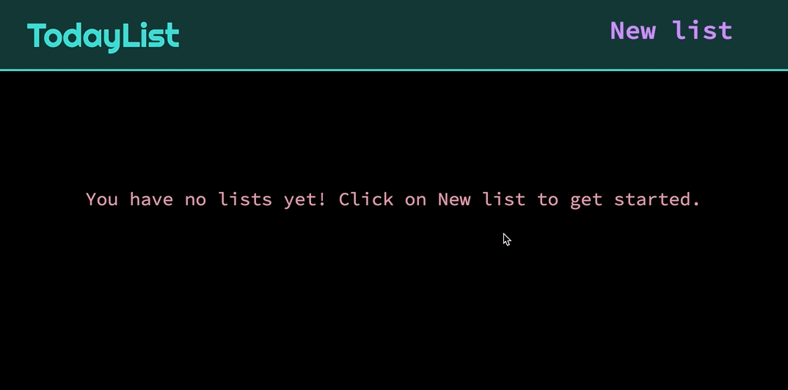

# 📝 TodayList

To-do list app using ReactJS. The app is deployed [here](https://solenedel.github.io/TodayList/).
The deployed app is front-end only. The full-stack version will be in a separate branch of the repo.

## Demo

### **1. Create a list, add tasks to the list**

### **2. Rename a list, mark tasks as complete or delete them**

### **3. Create more lists, delete a list**

## Project setup

To run in development mode: `npm run dev`

## Broken / to fix

- alert before deleting a list or a todo item
- clean up code

## Extra features

- select an icon for each list item (form fontawesome)
- move items between the two lists by dragging and dropping
